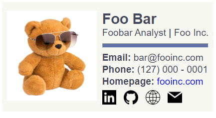
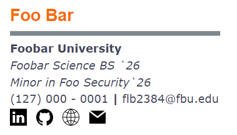

# Email Signatures
I was designing Email Signatures for work, and it became somewhat of a hobby. Here are a few signatures I've made, feel
free to use them.

## Usage
**Basic**

I've marked out areas to be filled in with your information. After changing the fields, open the `.html` file in the
browser of your choosing, select all and copy, then paste where needed.

**Icons**

For icons, you can replace the `img` src tag with your own
icons if you wish, or feel free to leave as is. This repo is public, linking the raw .png files should work.

**Profile Pictures**

Some signatures require Profile Pictures. There are a number of free images hosting sites where you can upload files and
receive short-links if you don't have the means to host your own images.

## Gallery
### Job Title 1

### School 1

